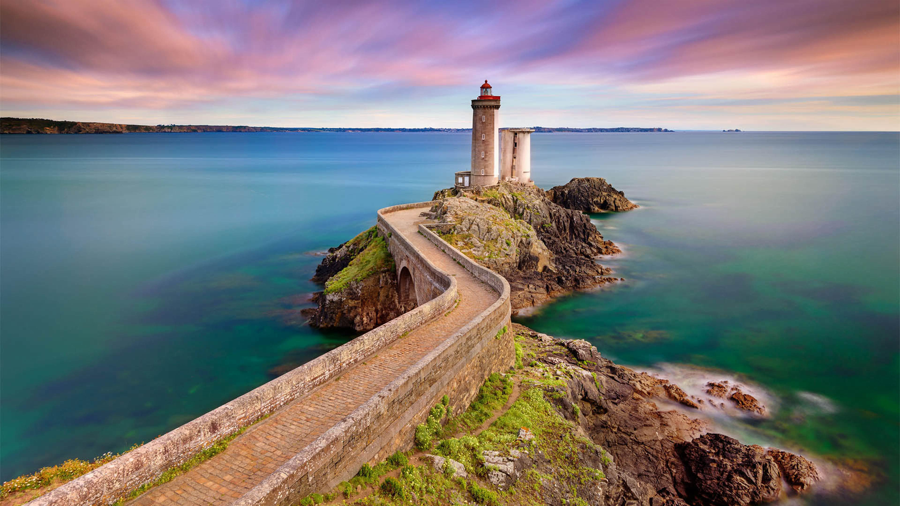
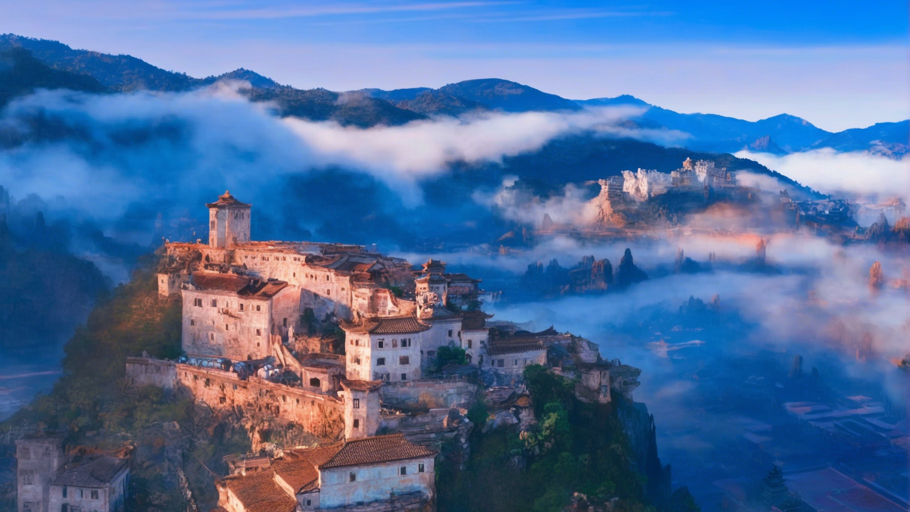
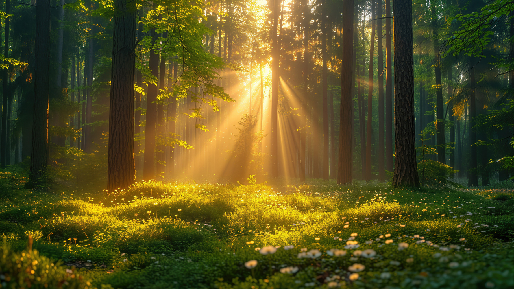
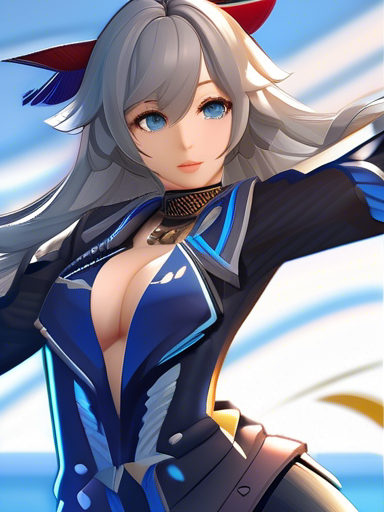
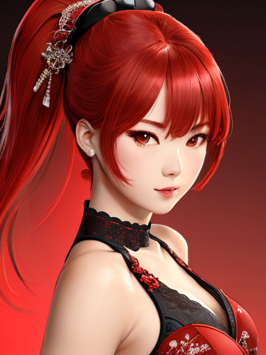
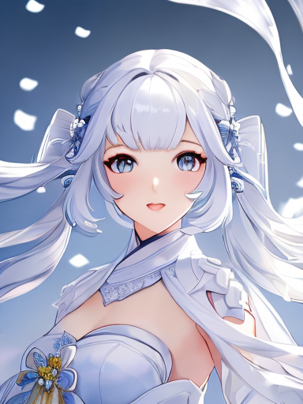
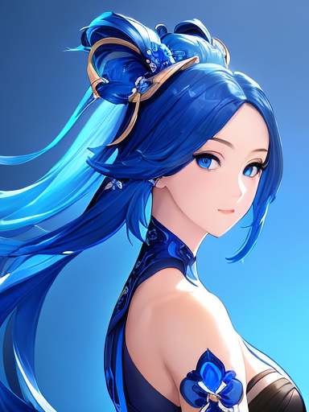
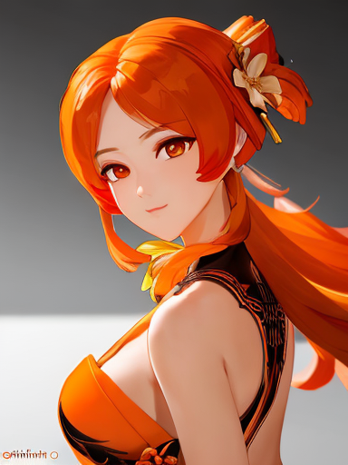

# Playground for diffusers
Playground for diffusers based on stable diffusion models

## LoRA
This is the playground to train a **LoRA** model based on Stable Diffusion diffusers.

The followings are the showcases of the LoRA models.

### Black Myth Wukong Style LoRA
| Original | sd-xl-blackmyth-lora-4 |
|-|-|
| |  |
| |  |
| |  |
### Genshin Impact(原神) Style LoRA
#### Based On Stable Diffusion XL 1.0
| stable diffusion XL Base 1.0 | sd-xl-genshin-lora-8 |
|-|-|
| |  |
| |  |
| |  |

### Based On DreamShaper
| dreamshaper | dreamshape-genshin-lora-4 | dreamshape-genshin-lora-8 | dreamshape-genshin-lora-16 |
|-|-|-|-|
| |  |  |  |
| |  |  |  |
| |  |  |  |

