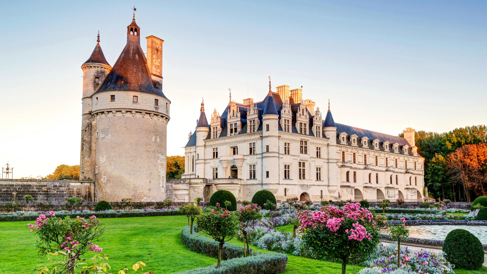

# Black Myth Wukong Style LoRA
This is the playground to train a *Black Myth Wukong* style LoRA model based on Stable Diffusion diffusers.

Here I used the huggingface API for the model training and inference.

*This repo only contains the inference code.*

The trained model is here:

- [RickDYang/sd-xl-lora-blackmyth](https://huggingface.co/RickDYang/sd-xl-lora-blackmyth)

## Train

Just follow the instructions in the [official huggingface repository](https://github.com/huggingface/diffusers).
Please refer the following documents for the training
- [Stable Diffusion XL text-to-image fine-tuning](https://github.com/huggingface/diffusers/blob/main/examples/text_to_image/README_sdxl.md)

### About Data
The data contains 28 *Black Myth* images which download from [Black Myth offical website](https://www.heishenhua.com/) with 1024 resolutions. The metadata.jsonl looks like
```json
{"file_name": "00001.png", "text": "(black myth wukong style)"}
{"file_name": "00002.png", "text": "(black myth wukong style)"}
```

`(black myth wukong style)` will be used in prompts in the later inference.

## About LoRA

 I trained the model based on [stabilityai/stable-diffusion-xl-base-1.0](https://huggingface.co/stabilityai/stable-diffusion-xl-base-1.0).


## Run

Before running, you could put your own images into the `in` folder. You can run the `run.sh` in subfolders to generate images. It will use `accelerate` to speed up the inference.

The generated images will be saved in the `in` folder with name postfix `-lora-4`.


### Results
Compared to the original images, the new style of images has darker lighting and shadows, the trees are more gnarled, the architectural style is more Chinese, the walls are more weathered and mottled, cars have been turned into stone blocks, and even a tree have been transformed into dilapidated pagodas.
| Original | sd-xl-blackmyth-lora-4 |
|-|-|
| |  |
| |  |
| |  |
| |  |
| |  |
| |  |
| |  |
| |  |
| |  |
| |  |
