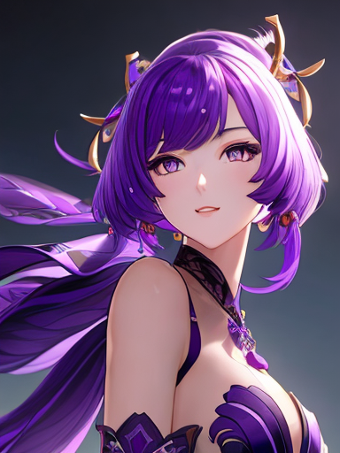
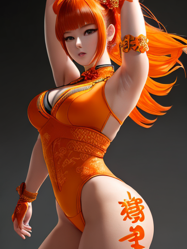
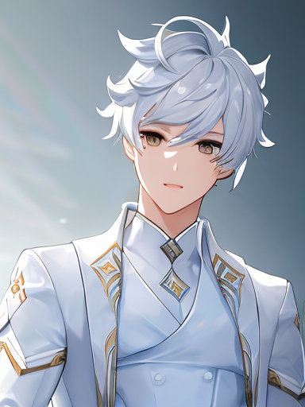
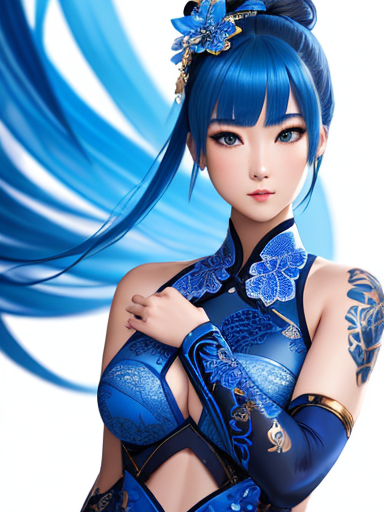
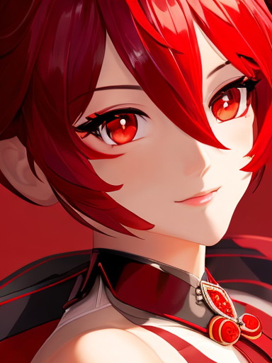

# Genshin Impact(原神) Style LoRA
This is the playground to train a Genshin Impact(原神) style LoRA model based on Stable Diffusion diffusers.

Here I used the huggingface API for the model training and inference.

*This repo only contains the inference code.*

The trained models are here:

- [RickDYang/dreamshaper-lora-genshin](https://huggingface.co/RickDYang/dreamshaper-lora-genshin)

- [RickDYang/sd-xl-genshin-lora](https://huggingface.co/RickDYang/sd-xl-genshin-lora)

## Train

Just follow the instructions in the [official huggingface repository](https://github.com/huggingface/diffusers).
Please refer the following documents for the training

- [Stable Diffusion text-to-image fine-tuning](https://github.com/huggingface/diffusers/blob/main/examples/text_to_image/README.md)
- [Stable Diffusion XL text-to-image fine-tuning](https://github.com/huggingface/diffusers/blob/main/examples/text_to_image/README_sdxl.md)

### About Data
The data contains 175 Genshin Impace images with 512x512 size. The metadata.jsonl looks like
```json
{"file_name": "00001.png", "text": "(genshin impact style)"}
{"file_name": "00002.png", "text": "(genshin impact style)"}
```

`(genshin impact style)` will be used in prompts in the later inference.

## About LoRAs

 I trained the two models separately based on [stabilityai/stable-diffusion-xl-base-1.0](https://huggingface.co/stabilityai/stable-diffusion-xl-base-1.0) and [xyn-ai/DreamShaper](https://huggingface.co/xyn-ai/DreamShaper)

### Resuls of DreamShape LoRA
| dreamshaper | dreamshape-genshin-lora-4 | dreamshape-genshin-lora-8 | dreamshape-genshin-lora-16 |
|-|-|-|-|
| |  |  |  |
| |  |  |  |
| |  |  |  |
| |  |  |  |
| |  |  |  |
| |  |  |  |
| |  |  |  |
| |  |  |  |
| |  |  |  |
| |  |  |  |

### Results of Stable Diffusion XL LoRA
| stable diffusion XL Base 1.0 | sd-xl-genshin-lora-8 |
|-|-|
| |  |
| |  |
| |  |
| |  |
| |  |
| |  |
| |  |
| |  |
| |  |
| |  |


## Run

You can run the `run.sh` in subfolders to generate images. It will use `accelerate` to speed up the inference.

The generated images will be saved in the `out` folder.


## Takeaway

### 1. Prompts matter

Prompts are highly impact the results. The generated results were not good if we did not include some positive and negative prompts, especially negative prompts.

I summarized the comment positive and negative prompts in `prompts.json`.

### 2. Base model matters

I tried the two different based models, and the results are different.

The results of dreamshaper LoRA are more gorgeous but further than real Genshin Impact. On the constract, the results of Stable Diffusion XL are more normal but closer to the real Genshin Impact styple. 

The dreamshaper is more likely to generate NSFW images, which is very bothering especially for `boy` prompt. I do not know why it happens. Please let me know if you have some explanation.

To avoid the NSFW images, I have to implement some retry logics.

Also the quality of results of Stable Diffusion XL are higher and more consistent, and no NSFW images are generated during my testing.

### 3. The ranks do not matter

For the small dataset(175 images), the ranks of the models do not matter. I trained the models of rank 4, 8 and 16, but the results are not significantly different.


### 4. Higher resolution results are not good

I trained the models with 512x512 images. The results of higher resolution images are not good. The stable diffusion pipeline uses some interpolation algorithm for higher resolution images. But the results contains some duplicated patterns and some artifacts. Here are some examples:
 
